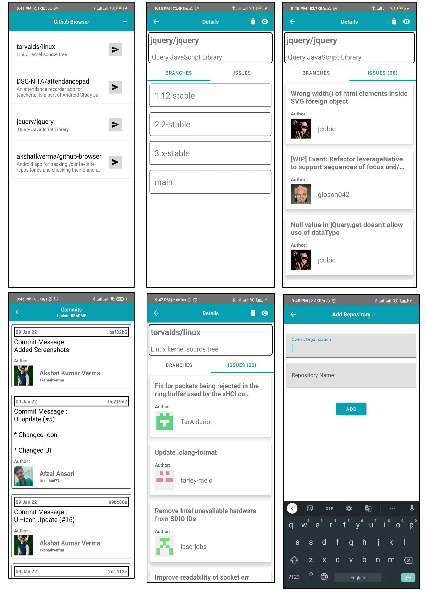

# Github Browser

This is an Android Native application which can be used for tracking your favorite repositories from your Android mobile. You can see the branches and the open issues in those branches with all the commits (commit message, user name, user avatar, user id) and the open issues as well.

It uses the GitHub APIs for fetching the data based upon the organization/owner and the repository name.
Room library is also used which implements SQLite to persist the data stored before (the repository owner/name).

## Use this application : 

1. You can download the [APK](https://drive.google.com/drive/folders/1C9xH9WcYx6rffR0CVlSphoOSo5yXyWQ_?usp=sharing).

2. Or you can clone the repository and import in Android Studio to see the code+build the APK.

```bash
git clone https://github.com/akshatkverma/github-browser
```

## Screenshots of the application :


